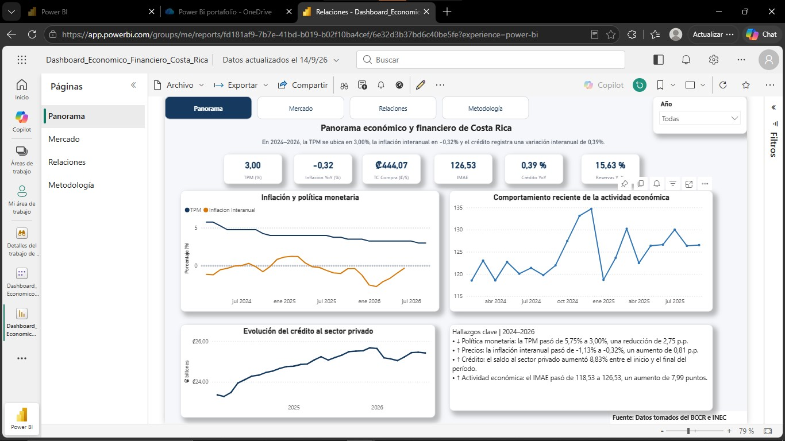
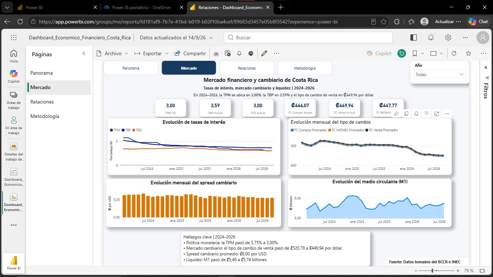
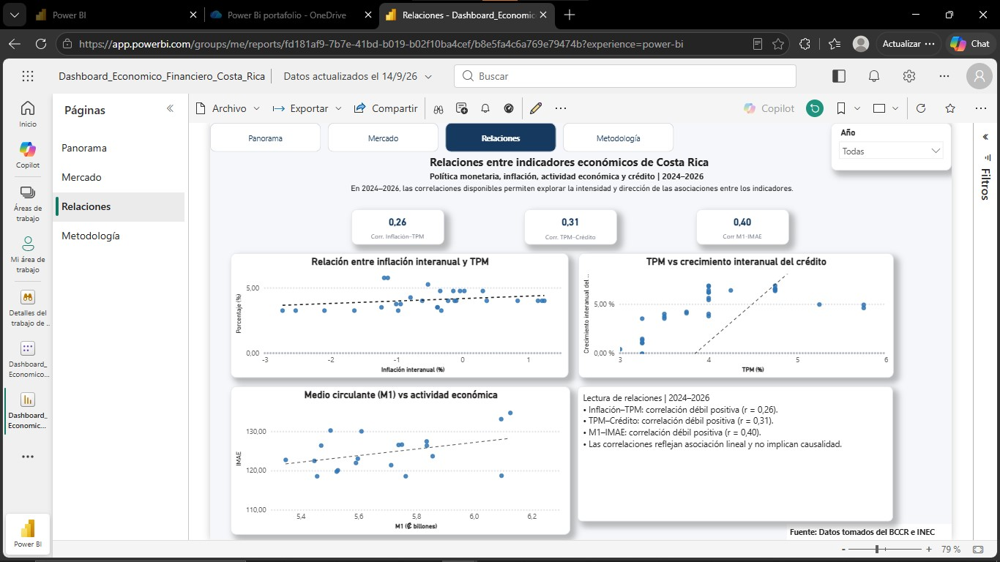
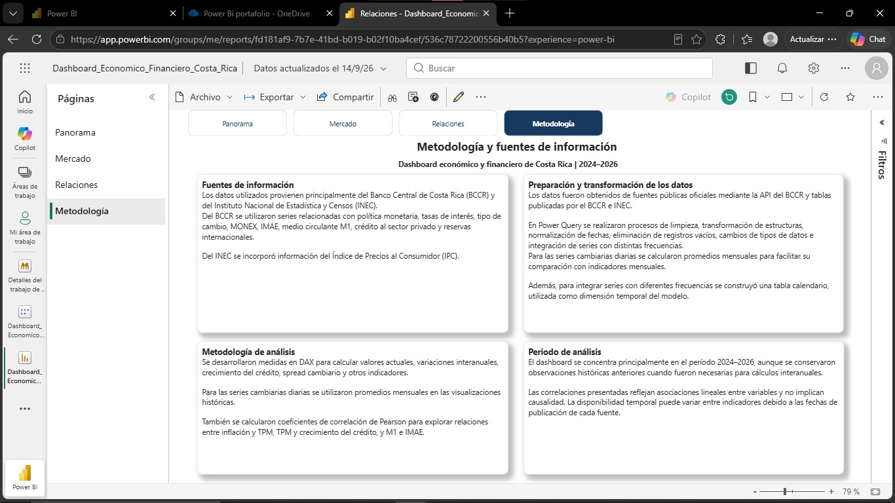

# 📊 Panorama económico y financiero de Costa Rica | 2024–2026

Proyecto de **aprendizaje y portafolio profesional** desarrollado en **Power BI** para explorar, analizar y visualizar la evolución de distintos indicadores económicos y financieros de Costa Rica durante el período **2024–2026**.

El proyecto integra información pública proveniente principalmente del **Banco Central de Costa Rica (BCCR)** y del **Instituto Nacional de Estadística y Censos (INEC)**, incorporando indicadores relacionados con política monetaria, inflación, actividad económica, crédito, mercado cambiario, liquidez y relaciones estadísticas entre variables.

> **Nota:** Este proyecto tiene fines educativos, demostrativos y de portafolio profesional. No corresponde a una publicación oficial del BCCR, INEC ni de ninguna otra institución.

---

## 📌 Vista general

---

## 🎯 Objetivo del proyecto

Desarrollar una herramienta interactiva que permita centralizar, visualizar y analizar diferentes indicadores económicos y financieros de Costa Rica, facilitando:

- La identificación de tendencias.
- El seguimiento de indicadores macroeconómicos.
- El análisis de variaciones interanuales.
- La comparación entre diferentes variables económicas.
- El seguimiento de tasas de interés y variables cambiarias.
- La exploración de relaciones estadísticas entre indicadores.
- La generación de interpretaciones mediante storytelling dinámico.
- La comunicación de información económica de forma visual y comprensible.

---

## 🛠️ Herramientas utilizadas

- **Power BI Desktop**
- **Power BI Service**
- **Power Query**
- **DAX**
- **API del Banco Central de Costa Rica**
- **Microsoft Excel**
- **SharePoint / OneDrive**
- **GitHub**

---

## 📚 Fuentes de información

### Banco Central de Costa Rica (BCCR)

Se utilizaron series e indicadores relacionados con:

- Tasa de Política Monetaria (TPM)
- Tasa Básica Pasiva (TBP)
- Tasa Efectiva en Dólares (TED)
- Tipo de cambio de compra
- Tipo de cambio de venta
- Mercado MONEX
- Índice Mensual de Actividad Económica (IMAE)
- Medio circulante (M1)
- Crédito al sector privado
- Reservas internacionales

### Instituto Nacional de Estadística y Censos (INEC)

Se utilizó información relacionada con:

- Índice de Precios al Consumidor (IPC)
- Inflación interanual

---

## 🔄 Preparación y transformación de datos

El procesamiento de la información se realizó principalmente mediante **Power Query**.

Entre las principales transformaciones realizadas se encuentran:

- Limpieza y depuración de datos.
- Normalización de fechas.
- Conversión de tipos de datos.
- Tratamiento de valores faltantes.
- Transformación de tablas provenientes de fuentes web.
- Integración de datos obtenidos mediante API.
- Integración de series con diferentes frecuencias.
- Reestructuración de tablas para facilitar su análisis.
- Conversión de determinadas series diarias a promedios mensuales.
- Creación de campos auxiliares de fecha.
- Construcción de una tabla calendario.
- Integración temporal de las diferentes fuentes de información.

También se modificaron las conexiones utilizadas durante el desarrollo para permitir que las fuentes pudieran ser consultadas desde **Power BI Service**, reduciendo la dependencia de archivos almacenados únicamente de forma local.

---

## 🧩 Integración de fuentes

El proyecto combina diferentes tipos de fuentes:

- **API REST del BCCR**
- **Fuentes web oficiales**
- **Archivos de Excel**
- **Archivos almacenados en SharePoint / OneDrive**
- **Información publicada por el INEC**

Para las consultas realizadas a la API del BCCR se implementó una función en **Power Query** que permite reutilizar la lógica de extracción para diferentes indicadores económicos.

---

## 🗓️ Modelo temporal

Se construyó una tabla calendario para facilitar el análisis de las diferentes series económicas.

La tabla permite trabajar con:

- Fecha
- Año
- Mes
- Número de mes
- Año-Mes
- Trimestre
- Inicio de mes

Esto facilita la comparación entre indicadores con distintas frecuencias de publicación y permite que los filtros temporales interactúen con las diferentes páginas del dashboard.

---

## 📐 Análisis y medidas DAX

Se desarrollaron diferentes medidas en **DAX** para complementar el análisis y mejorar la interacción del dashboard.

Entre ellas:

- Valores actuales de los indicadores.
- Identificación del último valor disponible.
- Variaciones interanuales.
- Crecimiento interanual del crédito.
- Promedios históricos.
- Spread cambiario.
- Comparaciones temporales.
- Manejo de períodos sin información disponible mediante `N/D`.
- Textos dinámicos según el período seleccionado.
- Storytelling automático.
- Coeficientes de correlación de Pearson.

---

## 🔗 Relaciones estadísticas analizadas

Se exploraron las siguientes relaciones:

- **Inflación ↔ Tasa de Política Monetaria**
- **TPM ↔ Crecimiento interanual del crédito**
- **M1 ↔ IMAE**

Para su análisis se utilizaron:

- Gráficos de dispersión.
- Líneas de tendencia.
- Coeficientes de correlación de Pearson.
- Medidas dinámicas de interpretación.

> Las correlaciones representan asociaciones estadísticas lineales entre variables y no implican relaciones de causalidad.

---

# 📊 Páginas del dashboard

## 1. Panorama económico

La primera página proporciona una visión general de algunos de los principales indicadores económicos y financieros analizados.

Incluye:

- Tasa de Política Monetaria.
- Inflación interanual.
- Tipo de cambio.
- IMAE.
- Crecimiento interanual del crédito.
- Reservas internacionales.
- Evolución de inflación y política monetaria.
- Evolución de la actividad económica.
- Evolución del crédito al sector privado.
- Hallazgos dinámicos según el período seleccionado.

---

## 2. Mercado financiero y cambiario

Esta página se concentra en el comportamiento de las tasas de interés, el mercado cambiario y la liquidez monetaria.

Incluye:

- TPM.
- TBP.
- TED.
- Tipo de cambio de compra.
- Tipo de cambio de venta.
- Tipo de cambio MONEX.
- Evolución de tasas de interés.
- Evolución mensual del tipo de cambio.
- Spread cambiario.
- Medio circulante M1.
- Lectura dinámica del comportamiento del mercado.

---

## 3. Relaciones entre indicadores económicos

Esta página explora asociaciones estadísticas entre diferentes variables económicas.

Incluye:

- Correlación entre inflación y TPM.
- Correlación entre TPM y crecimiento del crédito.
- Correlación entre M1 e IMAE.
- Gráficos de dispersión.
- Líneas de tendencia.
- Coeficientes de correlación.
- Interpretaciones dinámicas según el período seleccionado.

---

## 4. Metodología y fuentes

Esta página documenta el proceso utilizado para construir el dashboard.

Incluye:

- Fuentes de información.
- Preparación y transformación de datos.
- Metodología de análisis.
- Período de estudio.
- Consideraciones metodológicas.
- Limitaciones relacionadas con la disponibilidad de información.

---

## 💡 Storytelling dinámico

Uno de los componentes desarrollados para el proyecto fue la incorporación de **storytelling dinámico mediante DAX**.

Los textos cambian automáticamente según el período seleccionado por el usuario y permiten complementar las visualizaciones con información relacionada con:

- Cambios en política monetaria.
- Evolución de la inflación.
- Comportamiento del crédito.
- Actividad económica.
- Mercado cambiario.
- Liquidez.
- Intensidad y dirección de las correlaciones.

El objetivo es que el dashboard no se limite únicamente a presentar cifras, sino que también facilite su lectura e interpretación.

---

# 📌 Principales hallazgos e interpretación económica

Los siguientes hallazgos corresponden a una **lectura exploratoria de los indicadores incluidos en el dashboard**.

Las posibles explicaciones e implicaciones planteadas tienen como objetivo contextualizar los resultados observados y no deben interpretarse como relaciones causales demostradas.

---

### 🏦 1. Reducción de la Tasa de Política Monetaria

**Observación**

Durante el período analizado, la **Tasa de Política Monetaria (TPM)** presentó una trayectoria descendente, pasando aproximadamente de **5,75 % a 3,00 %**.

**¿Qué podría explicar este comportamiento?**

La TPM constituye uno de los principales instrumentos utilizados por el Banco Central para influir sobre las condiciones monetarias y la inflación.

La presencia de tasas de inflación reducidas e incluso negativas durante parte del período pudo generar mayor espacio para adoptar una política monetaria menos restrictiva.

Las decisiones de política monetaria también consideran las expectativas de inflación, el comportamiento de la actividad económica y diferentes riesgos internos y externos.

**Posibles implicaciones**

Una reducción de la TPM puede favorecer gradualmente:

- Menores tasas de interés en determinados productos financieros.
- Condiciones de financiamiento menos restrictivas.
- Mayor incentivo al consumo y la inversión.
- Una reducción en la remuneración de algunos instrumentos de ahorro.

Sin embargo, la transmisión de la TPM hacia las tasas del sistema financiero **no necesariamente es inmediata ni uniforme**.

---

### 🛒 2. Inflación baja y períodos con variaciones negativas

**Observación**

La inflación interanual presentó niveles reducidos y períodos con variaciones negativas durante el horizonte analizado.

**¿Qué podría explicar este comportamiento?**

La inflación puede verse influenciada por múltiples factores, entre ellos:

- Precios internacionales de materias primas.
- Evolución del tipo de cambio.
- Costos de bienes importados.
- Comportamiento de los precios de alimentos y combustibles.
- Condiciones de oferta.
- Demanda interna.
- Expectativas de inflación.

La apreciación del colón observada durante parte del período también puede contribuir a reducir el costo en moneda nacional de determinados productos importados y moderar algunas presiones sobre los precios.

**Posibles implicaciones**

Una inflación baja puede:

- Favorecer temporalmente el poder adquisitivo de los hogares.
- Reducir la presión para mantener tasas de interés elevadas.
- Facilitar una política monetaria menos restrictiva.

Sin embargo, una inflación persistentemente muy baja o negativa también requiere seguimiento, ya que puede estar asociada con presiones de precios débiles y generar retos para el cumplimiento de la meta de inflación.

---

### 💳 3. Crecimiento del crédito al sector privado con señales de moderación

**Observación**

El saldo del crédito al sector privado mostró una trayectoria general de crecimiento durante buena parte del período, aunque su ritmo de expansión presentó moderación en algunos meses de 2026.

**¿Qué podría explicar este comportamiento?**

La evolución del crédito puede estar relacionada con:

- Cambios en las tasas de interés.
- Demanda de financiamiento de hogares y empresas.
- Condiciones económicas.
- Expectativas de consumidores y empresas.
- Preferencia por crédito en colones o dólares.
- Políticas de colocación de las entidades financieras.

Una reducción de tasas puede favorecer la demanda de crédito, aunque el efecto puede presentarse con rezagos.

**Posibles implicaciones**

Un crecimiento sostenido del crédito puede apoyar:

- Consumo.
- Inversión empresarial.
- Vivienda.
- Actividad productiva.

Por otra parte, una desaceleración del crédito puede indicar una menor demanda por financiamiento o condiciones más prudentes de colocación.

Una moderación tampoco debe interpretarse automáticamente como una señal negativa, ya que tasas de crecimiento excesivamente elevadas pueden incrementar riesgos financieros.

---

### 💱 4. Tendencia descendente del tipo de cambio

**Observación**

El tipo de cambio de venta mostró una tendencia descendente hacia 2026 en comparación con los niveles observados al inicio del período analizado.

Esto representa una **apreciación del colón frente al dólar estadounidense**.

**¿Qué podría explicar este comportamiento?**

Entre los factores que pueden influir en el mercado cambiario se encuentran:

- Mayor disponibilidad de divisas.
- Exportaciones de bienes y servicios.
- Inversión extranjera.
- Turismo.
- Movimientos internacionales de capital.
- Demanda de dólares por parte de hogares y empresas.
- Comportamiento internacional del dólar.
- Intervenciones o requerimientos del sector público.

La abundancia relativa de divisas observada durante parte del período puede contribuir a generar presión hacia una apreciación de la moneda local.

**Posibles implicaciones**

Una apreciación del colón puede favorecer a:

- Importadores.
- Consumidores de productos importados.
- Personas o empresas con obligaciones en dólares e ingresos en colones.

Además, puede contribuir a moderar la inflación importada.

Sin embargo, también puede generar desafíos para:

- Exportadores.
- Empresas que reciben ingresos principalmente en dólares pero pagan costos en colones.
- Algunos sectores relacionados con turismo y servicios internacionales.

---

### 💵 5. Comportamiento del medio circulante M1

**Observación**

El medio circulante **M1** presentó fluctuaciones mensuales durante el período y mantuvo niveles elevados hacia 2026.

**¿Qué podría explicar este comportamiento?**

El M1 refleja principalmente recursos altamente líquidos utilizados para realizar transacciones.

Su evolución puede estar relacionada con:

- Mayor o menor demanda de dinero para transacciones.
- Comportamiento de los depósitos a la vista.
- Actividad económica.
- Crédito.
- Tasas de interés.
- Preferencias de hogares y empresas por mantener recursos líquidos.
- Factores estacionales.

**Posibles implicaciones**

Un incremento del M1 puede reflejar una mayor disponibilidad de liquidez transaccional en la economía.

Sin embargo, un aumento de la liquidez **no implica automáticamente un incremento de la inflación**.

Para realizar esa interpretación también deben considerarse la actividad económica, la demanda agregada, las expectativas y otros agregados monetarios.

---

### 📈 6. Actividad económica con crecimiento, pero menor dinamismo hacia 2026

**Observación**

El IMAE muestra una expansión de la actividad económica durante el período analizado; sin embargo, los datos más recientes evidencian una moderación del ritmo de crecimiento.

**¿Qué podría explicar este comportamiento?**

Entre los factores que pueden contribuir a una desaceleración se encuentran:

- Menor dinamismo de algunas actividades productivas.
- Efectos base derivados de tasas de crecimiento elevadas en períodos anteriores.
- Moderación de actividades pertenecientes a regímenes especiales.
- Condiciones internacionales.
- Evolución de la inversión y las exportaciones.

Por esta razón es importante distinguir entre:

**desaceleración** y **contracción**.

Una desaceleración significa que la economía continúa creciendo, pero lo hace a un ritmo menor.

**Posibles implicaciones**

Una moderación prolongada del crecimiento podría influir sobre:

- Empleo.
- Consumo.
- Inversión.
- Demanda de crédito.
- Recaudación tributaria.

No obstante, mientras la variación de la actividad siga siendo positiva, continúa existiendo crecimiento económico.

---

### 🌎 7. Reservas internacionales y capacidad de respuesta externa

**Observación**

Las reservas internacionales se mantuvieron en niveles relevantes durante el período analizado.

**¿Qué podría explicar este comportamiento?**

Las reservas pueden variar debido a factores como:

- Entrada y salida de divisas.
- Operaciones del Banco Central.
- Movimientos del sector público.
- Inversión extranjera.
- Exportaciones.
- Financiamiento externo.

**Posibles implicaciones**

Un nivel adecuado de reservas internacionales puede funcionar como un **amortiguador frente a choques externos**.

También contribuye a:

- Respaldar la capacidad de pago externo del país.
- Atender necesidades extraordinarias de divisas.
- Reducir vulnerabilidades ante episodios de volatilidad internacional.
- Fortalecer la capacidad de respuesta ante movimientos abruptos del mercado cambiario.

---

### 🔗 8. Relaciones entre inflación, TPM, crédito, M1 e IMAE

El dashboard incorpora coeficientes de correlación de Pearson para explorar las relaciones entre:

- Inflación y TPM.
- TPM y crecimiento del crédito.
- M1 e IMAE.

Los resultados muestran asociaciones de distinta intensidad y dirección según el período seleccionado.

Por ejemplo, una relación entre TPM y crédito puede tener sentido económico debido al efecto que las tasas de interés pueden ejercer sobre las decisiones de financiamiento.

De forma similar, el comportamiento del M1 puede presentar relación con la actividad económica debido a que una economía con mayor nivel de transacciones puede demandar una mayor cantidad de recursos líquidos.

Sin embargo, estos resultados deben interpretarse con precaución.

### Correlación ≠ causalidad

Una correlación estadística no demuestra que una variable provoque directamente cambios en otra.

Las relaciones observadas pueden verse afectadas por:

- Rezagos temporales.
- Factores externos.
- Cambios regulatorios.
- Condiciones financieras.
- Expectativas.
- Variables económicas no incorporadas en el modelo.

Por esta razón, el análisis de correlaciones desarrollado en este proyecto tiene un propósito principalmente **exploratorio**.

Para establecer relaciones causales sería necesario aplicar metodologías econométricas adicionales.

---

## 🧠 Lectura general del período

En conjunto, los indicadores permiten observar un período caracterizado por:

- Reducción gradual de la Tasa de Política Monetaria.
- Inflación reducida y períodos con variaciones negativas.
- Apreciación del colón frente al dólar.
- Crecimiento del crédito con cambios en su ritmo de expansión.
- Actividad económica todavía en expansión, aunque con señales de moderación.
- Fluctuaciones en la liquidez monetaria.
- Niveles relevantes de reservas internacionales.

Estos elementos se encuentran relacionados dentro del funcionamiento general de la economía, aunque no deben interpretarse de forma aislada.

El comportamiento de una variable puede responder simultáneamente a factores monetarios, financieros, productivos, externos y de expectativas.

---

## ☁️ Publicación y actualización en Power BI Service

El proyecto fue publicado en **Power BI Service**.

Durante el proceso se configuraron conexiones en la nube para integrar:

- API del BCCR.
- Fuentes web oficiales.
- Archivos almacenados en SharePoint / OneDrive.

También se ajustaron consultas de Power Query para permitir su procesamiento desde el servicio en la nube.

El modelo semántico fue probado mediante una actualización desde **Power BI Service**, verificando la correcta conexión y procesamiento de las diferentes fuentes utilizadas.

---

## 🔄 Actualización de información

El proyecto fue diseñado para facilitar la incorporación de nueva información conforme las fuentes oficiales actualicen sus indicadores.

Debido a que las diferentes series poseen frecuencias y fechas de publicación distintas, no necesariamente todos los indicadores disponen de información para el mismo último mes.

Por este motivo, algunas visualizaciones pueden mostrar `N/D` cuando no existe información suficiente para realizar determinado cálculo.

---

## 🧭 Navegación e interacción

El dashboard incorpora un sistema de navegación entre páginas:

- **Panorama**
- **Mercado**
- **Relaciones**
- **Metodología**

También incluye un segmentador de **Año**, sincronizado entre las principales páginas de análisis.

Esto permite consultar:

- 2024
- 2025
- 2026
- Todo el período disponible

Los indicadores, gráficos, correlaciones y textos dinámicos responden a la selección realizada.

---

## 🔐 Seguridad y publicación del proyecto

El repositorio contiene documentación y capturas del proyecto.

Por razones de seguridad, no se publican credenciales, tokens de autenticación, información de acceso ni otros parámetros sensibles utilizados para realizar conexiones con las fuentes de datos.

El archivo de Power BI tampoco se distribuye públicamente mientras contenga configuraciones o parámetros de conexión que requieran protección.

---

## ⚠️ Consideraciones metodológicas

- El período principal de análisis corresponde a **2024–2026**.
- Algunas series anteriores a 2024 fueron conservadas cuando eran necesarias para realizar cálculos históricos o interanuales.
- La disponibilidad temporal puede variar entre indicadores debido a sus diferentes fechas y frecuencias de publicación.
- Determinados indicadores pueden presentar períodos sin información disponible.
- Los valores pueden ser revisados o actualizados posteriormente por las instituciones responsables de su publicación.
- Las visualizaciones y cálculos dependen de la información disponible en las fuentes al momento de cada actualización.
- Las correlaciones representan asociaciones estadísticas lineales y no deben interpretarse como relaciones de causalidad.
- Las interpretaciones incluidas corresponden a un ejercicio exploratorio y de aprendizaje.

---

## ⚠️ Aviso importante y descargo de responsabilidad

Este proyecto fue desarrollado con fines **educativos, de aprendizaje, demostración técnica y portafolio profesional**, con el propósito de aplicar y fortalecer conocimientos en análisis de datos, Power BI, Power Query, DAX, visualización de información y Business Intelligence.

El dashboard **no constituye una publicación oficial** del Banco Central de Costa Rica (BCCR), del Instituto Nacional de Estadística y Censos (INEC) ni de ninguna otra institución pública o privada.

El autor del proyecto no representa ni actúa en nombre de dichas instituciones.

La información utilizada proviene principalmente de fuentes públicas y oficiales. Sin embargo, durante los procesos de extracción, transformación, integración, actualización, cálculo, interpretación y visualización pueden producirse diferencias, retrasos, omisiones o errores involuntarios.

Aunque se procura mantener la información y los cálculos consistentes con las fuentes originales, **no se garantiza que el contenido del proyecto sea completamente exacto, exhaustivo o que se encuentre actualizado en todo momento**.

Para cualquier uso oficial, profesional o relacionado con la toma de decisiones, se recomienda consultar y validar la información directamente en las fuentes oficiales correspondientes.

Los análisis, interpretaciones, cálculos, correlaciones, posibles explicaciones e implicaciones presentadas tienen exclusivamente fines educativos y demostrativos.

**No constituyen asesoría financiera, económica, de inversión, contable, legal ni de ninguna otra naturaleza profesional.**

Las posibles explicaciones económicas incluidas en este proyecto representan interpretaciones exploratorias basadas en el comportamiento de los indicadores y en información económica disponible. No deben considerarse demostraciones de causalidad.

El uso de nombres, datos y referencias al BCCR, INEC u otras instituciones tiene únicamente fines informativos y de identificación de las fuentes utilizadas.

---

## 📖 Referencias de contexto para la interpretación

Para complementar la interpretación económica de los indicadores se consideraron publicaciones oficiales, entre ellas:

- Banco Central de Costa Rica — **Informe de Política Monetaria, julio 2026**.
- Banco Central de Costa Rica — **Informes mensuales de coyuntura económica**.
- Banco Central de Costa Rica — **Índice Mensual de Actividad Económica (IMAE)**.
- Banco Central de Costa Rica — **Indicadores económicos y financieros**.
- Instituto Nacional de Estadística y Censos — **Índice de Precios al Consumidor (IPC)**.

Las cifras oficiales deben verificarse directamente en las publicaciones más recientes de cada institución.

---

## 👤 Autor

**Mario Hernández**

Proyecto desarrollado como parte de un portafolio profesional orientado a:

- Análisis de Datos
- Business Intelligence
- Power BI
- Visualización de información
- Análisis económico y financiero

---

### 📌 Estado del proyecto

**Proyecto de aprendizaje y portafolio profesional.**

El dashboard podrá continuar evolucionando conforme se incorporen nuevos datos, indicadores, metodologías y herramientas de análisis.
